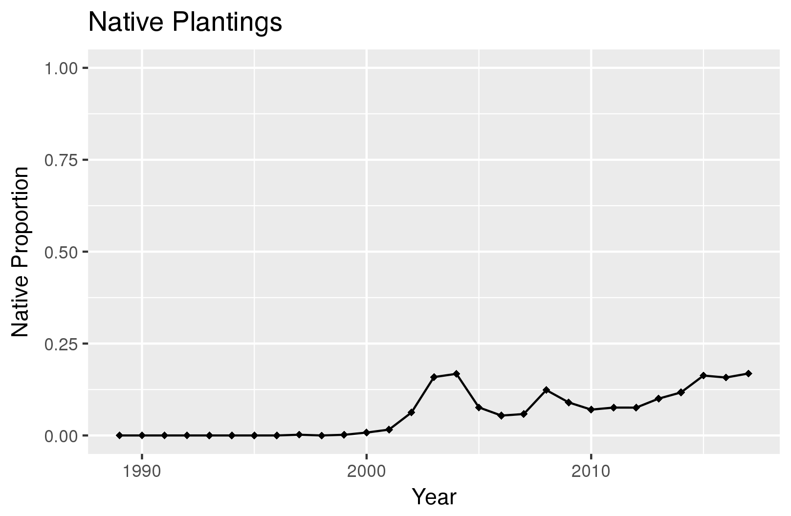
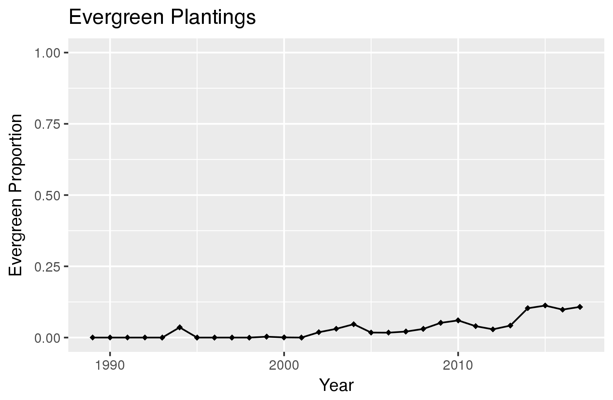
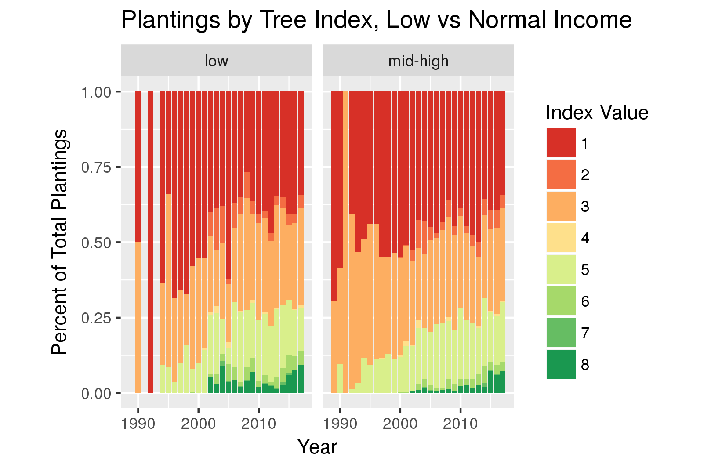
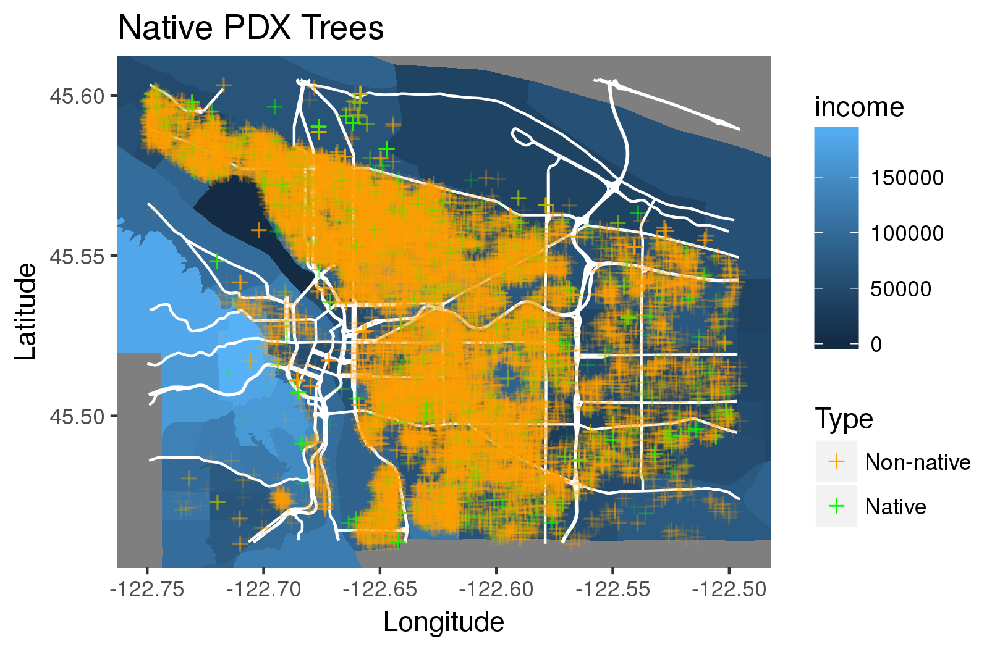
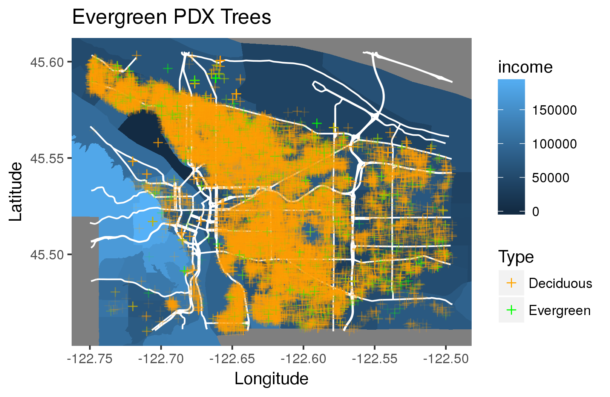

A Study of Portland Street Tree Planting Trends
================
Miranda Rintoul and Lirui Jiao

-   [Introduction](#introduction)
-   [Data](#data)
    -   [Raw data](#raw-data)
    -   [Transformation](#transformation)
-   [Analysis](#analysis)
    -   [Tree Planting Evaluation](#tree-planting-evaluation)
    -   [Planting and Income](#planting-and-income)

Introduction
============

Our main area of interest is recent tree planting efforts by the City of Portland and the nonprofit Friends of Trees. We hope to see if the overall quality of planted trees has increased over time, and we are specifically interested in studying the planting efforts of low-income areas of Portland, defined as having a median income that is less than 80% of the greater Portland median income.

Secondly, we will study the persistence of Portland street trees by using a tree survey conducted from 2010-2016. We hope to discover which planted trees are still alive and in good condition, and which ones are no longer planted.

Data
====

Raw data
--------

We began with four datasets:

-   A database of tree plantings done by the City of Portland and Friends of trees. The data covers years 1989-2018 and contains information on the locations of the properties where these trees were planted.

-   A recent survey of street trees conducted by ?????. It covers the years 2010-2016 and describes the condition of all the trees surveyed.

-   A spatial dataset of Portland census tracts. We will be studying income on the census tract level, and we will use this data to make informative maps of the city.

-   A list of median income levels by census tract.

Transformation
--------------

First, we joined the planting data with the census tract data by location. This allowed us to figure out what tract, and therefore what income level, a tree belonged to.

Then, we built a "tree index" to more easily describe the overall quality of a tree. We are using the following index:

*Q* = *S* + *N* + *E*

where *Q* is the overall quality of a tree, *S* is the tree's size, *N* depends on whether a tree is native, and *S* depends on whether a tree is evergreen or deciduous. Large, native, and evergreen trees are considered to be the best types of trees.

After that, we created a new tree dataset by combining the planting and survey data. We joined these two datasets by address and by species, and noted whether or not each observation that existed in the planting dataset was also in the survey.

A more detailed description of the data transforming process can be found [here](https://github.com/ds-civic-data/pdx-tree-planting/blob/master/data-raw/data-tidy.md).

Analysis
========

Tree Planting Evaluation
------------------------

Before studying how planting relates to income, we will assess the overall quality of planted trees. We'll do this by looking at the number of trees planted over time, then by studying proportional trends in the index, size, native, and evergreen variables.

The number of trees planted has increased by quite a bit since the 1990s, but appears to have dropped off in the last 5 years.

The overall quality of planted trees has increased over time. There are more excellent trees (value of 8) in recent years, but fewer good trees (index value of 5). The number of mediocre trees, with an index of 2-3, has remained fairly constant.

What tree qualities (size, native, evergreen) have shown the most improvement?

In the period 1992-2005, there was an increase in large tree planting, and a decrease in small tree planting. However, this affect has apparently plateaued off in very recent years. This could be an indication that planting efforts should be re-focused to include more large trees. However, it is possible that the city is at carrying capacity for large trees - only a limited number of streets, parks, and yards have room for them.

While small, the number of native plantings has improved over the last decade or so.

Similarly, though the proportion has been rising, evergreen trees make up only a small fraction of the planting data.

**Conclusions**

Though the quality of planted trees has been steadily increasing, there is still room for improvement. There is a healthy mix of different sizes of trees, but very small numbers of evergreen and native trees. Thus, we believe increasing the number of these beneficial trees is a worthwhile goal for future planting projects Further, more effort should be made to maintain a high number of trees planted per year.

Planting and Income
-------------------

We will attempt to address the issue of planting equity by building charts and maps. As before, we will focus on the index, size, native, and evergreen variables to assess tree quality.

Initially, it seems that index remains relatively equal across low and normal income areas. Planting in low income areas started out poor, but got better over time, while planting in normal income areas has remained somewhat more stable.

Mapping trees by index, however, reveals some notable areas of interest (marked in white) that were not visible before. Two points, centered at approximately NE Martin Luther King Jr Blvd and NE Prescott St, and at NE 15th Ave and NE Dakum St (both in North Portland), are areas with relatively low income and a concentration of poor quality trees. The areas surrounding NE 20th St and NE Siskiyou St, NE Glisan and NE Cesar Chavez Blvd, and SE Knapp St and SE 36th Ave, however, have relatively high income and a large number of good quality trees.

Over time, the proportions of small and large trees has remained fairly similar across different income areas.

This map suggests that tree size might account for the disparity between the points of interest uncovered by the index map. Perhaps some of these areas do not have room for very large trees.

These four visuals suggest that, though somewhat sparse, evergreen and native trees are dispersed fairly evenly across the city.

**Conclusions**

In general, planting efforts by the city and Friends of Trees have been fairly equitable. There are a few notable areas with low median income and poor tree quality, which seem to have been caused by a disparity in tree size. Since many areas do not have room for large trees, it might be worthwhile to fill these spots with evergreen or native trees to make up for being forced to use smaller trees.
