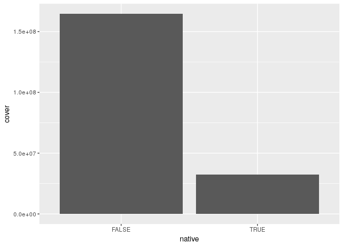

Basic questions
================
------------------------------------------------------------------------
4/16/2018

``` r
# initial tidy dataset - still needs some work
trees <- read.csv("~/emergency-response-time/data/tree_tidy.csv")
```

#### Basic stuff

``` r
str(trees)
```

    ## 'data.frame':    41959 obs. of  15 variables:
    ##  $ xcoord     : num  7653423 7653423 7653423 7653423 7654347 ...
    ##  $ ycoord     : num  691920 691920 691920 691920 693381 ...
    ##  $ year       : int  2008 2008 2008 2008 2008 2008 2008 2008 2008 2008 ...
    ##  $ name       : Factor w/ 147 levels "Alaska yellow-cedar",..: 119 143 143 143 119 119 14 14 14 14 ...
    ##  $ size       : Factor w/ 3 levels "L","M","S": 1 1 1 1 1 1 1 1 1 1 ...
    ##  $ canopy_rad : int  60 60 60 60 60 60 60 60 60 60 ...
    ##  $ canopy_area: num  11310 11310 11310 11310 11310 ...
    ##  $ native     : logi  FALSE TRUE TRUE TRUE FALSE FALSE ...
    ##  $ nuisance   : logi  FALSE FALSE FALSE FALSE FALSE FALSE ...
    ##  $ edible     : Factor w/ 3 levels "fruit","none",..: 2 2 2 2 2 2 2 2 2 2 ...
    ##  $ family     : Factor w/ 39 levels "Altingiaceae",..: 14 10 10 10 14 14 34 34 34 34 ...
    ##  $ species    : Factor w/ 147 levels "Abies grandis",..: 113 137 137 137 113 113 8 8 8 8 ...
    ##  $ origin     : Factor w/ 6 levels "Africa","Asia",..: 5 5 5 5 5 5 5 5 5 5 ...
    ##  $ funct      : Factor w/ 4 levels "BD","BE","CD",..: 1 4 4 4 1 1 1 1 1 1 ...
    ##  $ group      : Factor w/ 4 levels "contractor","park",..: 4 4 4 4 4 4 4 4 4 4 ...

``` r
nrow(trees)
```

    ## [1] 41959

``` r
table(trees$native)
```

    ## 
    ## FALSE  TRUE 
    ## 37286  4673

``` r
table(trees$nuisance)
```

    ## 
    ## FALSE  TRUE 
    ## 40443  1516

``` r
table(trees$edible)
```

    ## 
    ## fruit  none  nuts 
    ##  2035 38953   971

``` r
table(trees$size)
```

    ## 
    ##     L     M     S 
    ##  9157 13856 18946

``` r
table(trees$origin)
```

    ## 
    ##        Africa          Asia     Australia        Europe North America 
    ##            11         18885             1          5511         17485 
    ## South America 
    ##            66

``` r
table(trees$funct)
```

    ## 
    ##    BD    BE    CD    CE 
    ## 39272  1084   186  1417

Only a small number of trees, about 1500, are considered to be nuisance trees.

#### Tables

``` r
# native vs nuisance
table(trees$native, trees$nuisance)
```

    ##        
    ##         FALSE  TRUE
    ##   FALSE 35770  1516
    ##   TRUE   4673     0

``` r
# native vs edible
table(trees$native, trees$edible)
```

    ##        
    ##         fruit  none  nuts
    ##   FALSE  2035 35109   142
    ##   TRUE      0  3844   829

``` r
# native vs size
table(trees$native, trees$size)
```

    ##        
    ##             L     M     S
    ##   FALSE  6611 13619 17056
    ##   TRUE   2546   237  1890

``` r
# nuisance vs size
table(trees$nuisance, trees$size)
```

    ##        
    ##             L     M     S
    ##   FALSE  8376 13121 18946
    ##   TRUE    781   735     0

Interestingly, all nuisance trees are either large or medium.

#### Visuals

``` r
#trees by year, native vs non native
trees %>%
  filter(year<2018) %>%
  ggplot(aes(x=year,fill=native)) + 
    geom_bar()
```


It seems like the number of native plantings has increased in recent years.

``` r
# native trees and canopy cover
trees %>%
  group_by(native) %>%
  summarize(cover=sum(canopy_area)) %>%
  ggplot(aes(x=native,y=cover)) +
    geom_col()
```



``` r
# nuisance trees and canopy cover
trees %>%
  group_by(nuisance) %>%
  summarize(cover=sum(canopy_area)) %>%
  ggplot(aes(x=nuisance,y=cover)) +
    geom_col()
```


``` r
# plantings by group
trees %>%
  filter(year<2018) %>%
  ggplot(aes(x=year)) +
  geom_bar() +
  facet_wrap(~ group)
```


``` r
# plantings by functional group
trees %>%
  filter(year<2018) %>%
  ggplot(aes(x=year)) +
  geom_bar() +
  facet_wrap(~ funct)
```


``` r
# tree diversity
trees %>%
  filter(year < 2018) %>%
  group_by(year) %>%
  summarize(spec_num = n_distinct(species)) %>%
  ggplot(aes(x=year,y=spec_num)) + 
  geom_col()
```


