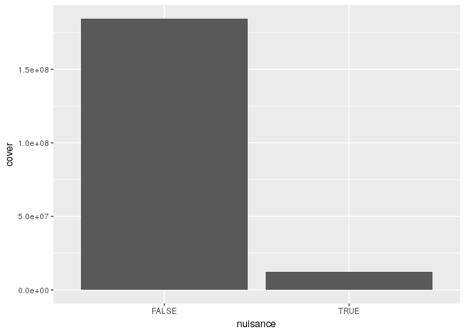
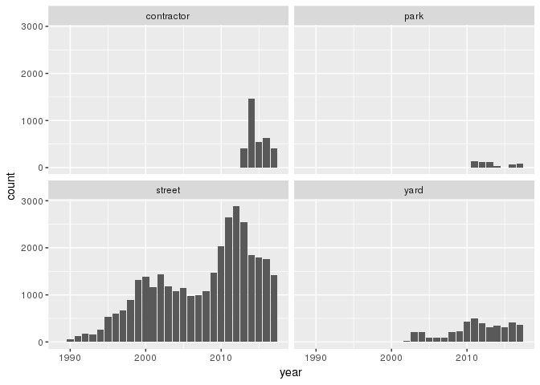
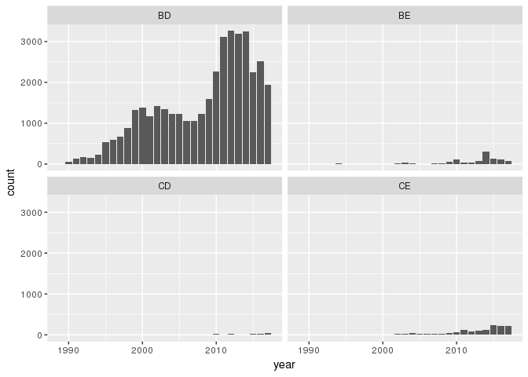

Basic questions
================
Miranda Rintoul
4/16/2018

``` r
# initial tidy dataset - still needs some work
trees <- read.csv("~/emergency-response-time/data/tree_tidy.csv")
```

#### Basic stuff

``` r
str(trees)
```

    ## 'data.frame':    52673 obs. of  15 variables:
    ##  $ xcoord     : num  7653423 7653423 7653423 7653423 7653691 ...
    ##  $ ycoord     : num  691920 691920 691920 691920 692065 ...
    ##  $ year       : int  2008 2008 2008 2008 2008 2008 2008 2008 2008 2008 ...
    ##  $ name       : Factor w/ 179 levels "Alaska yellow-cedar",..: 145 174 174 174 56 145 145 16 16 16 ...
    ##  $ size       : Factor w/ 3 levels "L","M","S": 1 1 1 1 1 1 1 1 1 1 ...
    ##  $ canopy_rad : int  60 60 60 60 60 60 60 60 60 60 ...
    ##  $ canopy_area: num  11310 11310 11310 11310 11310 ...
    ##  $ native     : logi  FALSE TRUE TRUE TRUE FALSE FALSE ...
    ##  $ nuisance   : logi  FALSE FALSE FALSE FALSE FALSE FALSE ...
    ##  $ edible     : Factor w/ 3 levels "fruit","none",..: 2 2 2 2 2 2 2 2 2 2 ...
    ##  $ family     : Factor w/ 41 levels "Altingiaceae",..: 16 10 10 10 41 16 16 36 36 36 ...
    ##  $ species    : Factor w/ 179 levels "Abies grandis",..: 139 165 165 165 173 139 139 8 8 8 ...
    ##  $ origin     : Factor w/ 133 levels "","Africa - Atlas Mountains of Morocco and Algeria",..: 126 73 73 73 1 126 126 112 112 112 ...
    ##  $ funct      : Factor w/ 4 levels "BD","BE","CD",..: 1 4 4 4 1 1 1 1 1 1 ...
    ##  $ group      : Factor w/ 4 levels "contractor","park",..: 4 4 4 4 4 4 4 4 4 4 ...

``` r
nrow(trees)
```

    ## [1] 52673

``` r
table(trees$native)
```

    ## 
    ## FALSE  TRUE 
    ## 47966  4707

``` r
table(trees$nuisance)
```

    ## 
    ## FALSE  TRUE 
    ## 51157  1516

``` r
table(trees$edible)
```

    ## 
    ## fruit  none  nuts 
    ##  3695 48007   971

``` r
table(trees$size)
```

    ## 
    ##     L     M     S 
    ## 11002 16791 24880

``` r
# still need to figure out what the "function" col refers to
table(trees$funct)
```

    ## 
    ##    BD    BE    CD    CE 
    ## 49913  1084   186  1490

Only a small number of trees, about 1500, are considered to be nuisance trees.

#### Tables

``` r
# native vs nuisance
table(trees$native, trees$nuisance)
```

    ##        
    ##         FALSE  TRUE
    ##   FALSE 46450  1516
    ##   TRUE   4707     0

``` r
# native vs edible
table(trees$native, trees$edible)
```

    ##        
    ##         fruit  none  nuts
    ##   FALSE  3695 44129   142
    ##   TRUE      0  3878   829

``` r
# native vs size
table(trees$native, trees$size)
```

    ##        
    ##             L     M     S
    ##   FALSE  8422 16554 22990
    ##   TRUE   2580   237  1890

``` r
# nuisance vs size
table(trees$nuisance, trees$size)
```

    ##        
    ##             L     M     S
    ##   FALSE 10221 16056 24880
    ##   TRUE    781   735     0

Interestingly, all nuisance trees are either large or medium.

#### Visuals

``` r
#trees by year, native vs non native
trees %>%
  filter(year<2018) %>%
  ggplot(aes(x=year,fill=native)) + 
    geom_bar()
```


It seems like the number of native plantings has increased in recent years.

``` r
# native trees and canopy cover
trees %>%
  group_by(native) %>%
  summarize(cover=sum(canopy_area)) %>%
  ggplot(aes(x=native,y=cover)) +
    geom_col()
```


``` r
# nuisance trees and canopy cover
trees %>%
  group_by(nuisance) %>%
  summarize(cover=sum(canopy_area)) %>%
  ggplot(aes(x=nuisance,y=cover)) +
    geom_col()
```



``` r
# plantings by group
trees %>%
  filter(year<2018) %>%
  ggplot(aes(x=year)) +
  geom_bar() +
  facet_wrap(~ group)
```



``` r
# plantings by functional group
trees %>%
  filter(year<2018) %>%
  ggplot(aes(x=year)) +
  geom_bar() +
  facet_wrap(~ funct)
```



``` r
# tree diversity
trees %>%
  filter(year < 2018) %>%
  group_by(year) %>%
  summarize(spec_num = n_distinct(species)) %>%
  ggplot(aes(x=year,y=spec_num)) + 
  geom_col()
```


