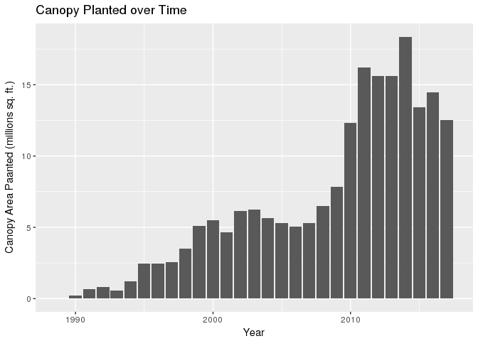
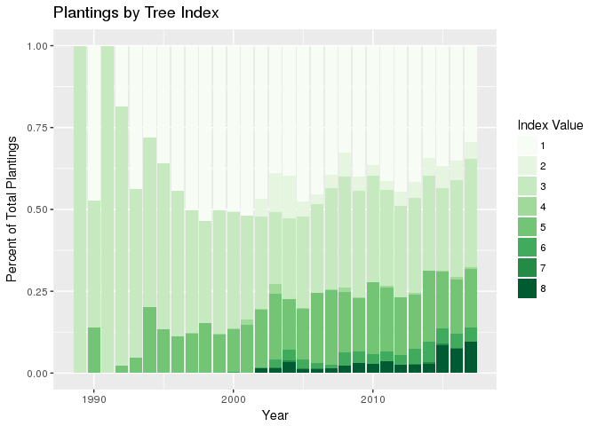
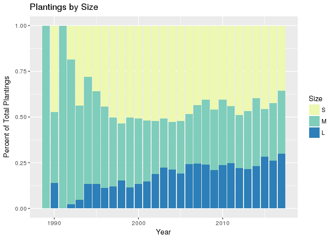
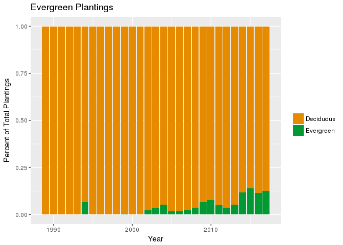
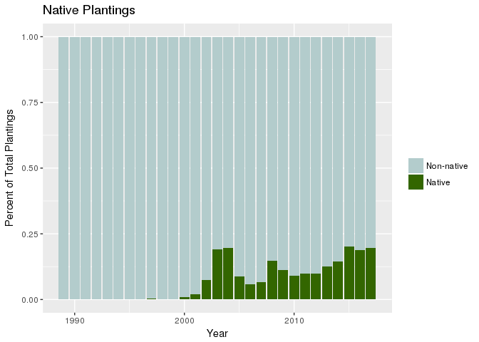

Planting Evaluations
================
------------------------------------------------------------------------
4/21/2018

``` r
# load up indexed tree data
trees <- read.csv("~/emergency-response-time/data/tree_tidy_index.csv")
```

##### How much canopy area has been planted each year?

``` r
trees %>%
  filter(year < 2018) %>%
  group_by(year) %>%
  summarize(area=sum(canopy_area)/1000000) %>%
  ggplot(aes(x=year,y=area)) + 
  geom_col() +
  labs(title="Canopy Planted over Time",x="Year",
       y="Canopy Area Paanted (millions sq. ft.)")
```



Canopy area planted has increased significantly in recent years, but has decreased slightly in the last ~5 years.

##### Are we planting the "right" types of trees?

To answer this, I'll use a [tree index](https://github.com/ds-civic-data/nuisance-trees/blob/master/code/tree-index.md).

``` r
trees %>%
  filter(year < 2018) %>%
  ggplot(aes(x=year,fill=factor(index))) + 
  geom_bar(position="fill") +
  scale_fill_brewer(palette="Greens") +
  labs(title="Plantings by Tree Index",x="Year",y="Percent of Total Plantings",
       fill="Index Value")
```



According to the tree index, there has been a recent increase in the "right" types of trees being planted. Let's look at more specific parts of this question.

##### Large Tree Plantings Over Time

``` r
trees %>%
  filter(year < 2018) %>%
  ggplot(aes(x=year,fill=factor(size,levels=c("S","M","L")))) + 
  geom_bar(position="fill") +
  scale_fill_brewer(palette="YlGnBu") +
  labs(title="Plantings by Size",x="Year",y="Percent of Total Plantings",
       fill="Size")
```



The proportion of large trees planted has been steadily increasing over time.

##### Evergreen Plantings Over Time

``` r
trees %>%
  filter(year < 2018) %>%
  mutate(ever = ifelse(funct %in% c("BE","CE"),T,F)) %>%
  ggplot(aes(x=year,fill=ever)) + 
    geom_bar(position="fill") +
  scale_fill_manual(labels = c("Deciduous","Evergreen"),
                    values=c("#e68a00","#009933")) +
  labs(title="Evergreen Plantings",x="Year",y="Percent of Total Plantings",
       fill="")
```



The proportion of evergreen plantings is still quite low, but it is improving.

##### Native Plantings Over Time

``` r
trees %>%
  filter(year < 2018) %>%
  ggplot(aes(x=year,fill=native)) +
  geom_bar(position="fill") +
  scale_fill_manual(labels=c("Non-native","Native"),
                    values=c("#b3cccc","#336600")) +
  labs(title="Native Plantings",x="Year",y="Percent of Total Plantings",
       fill="")
```


